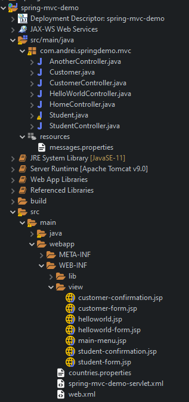

# 04-spring-mvc-demo
First Spring MVC  project.  
Form.  Hibernate Validator  

Main menu with  three direction:
-	Hello World : ask for your name, send it to Controller, edit to upper case, send it back;
-	Student form: take a student java object and apply to it various form tags;
-	Customer form: take a customer java object and validate for required fields, number range, regular expressions.

	
Building steps:
File - New – Dynamic web project.
1.	add  necessary  JAR files  (Not a Maven project);
2.	add configuration in web.xml, spring-mvc-demo-servlet;
3.	create HomeController
4.	create main-menu.jsp
5.	reading form data with Spring MVC: 
    -	HelloWorldController
    -	helloworld-form.jsp
    -	hello.jsp
6.	adding data to Spring Model (Student)
    -	Student class
    -	StudentController 
    -	student-form.jsp
    -	student-confirmation.jsp
7.	Spring MVC Form Tags (Student) 
    -	%@taglib prefix=”form”....%
    -	form:form; form:input; form:options; form:errors; form:select; form:radiobutton.
8.	Spring MVC Form Validation with Hibernate Validator (Customer)
    -	add validation JARs Hibernate Validator 6.x
    -	add validation rule to Customer class: required fields, number range, regular expressions;
    -	perform validation in CustomerController class;
    -	customer-form.jsp
    -	customer-confirmation.jsp

Run project :    -> run on server

Config:  xml config files: web.xml, spring-mvc-dem-servlet.xml.
LIB : spring jar file; hibernate-validator jar files;  javax.servlet-api-4.0.1.jar;  javax.servlet.jsp.jstl; javax.servlet.jsp.jstl-api-1.2.1.

[BACK TO START PAGE](https://github.com/FlorescuAndrei/Start.git) 

